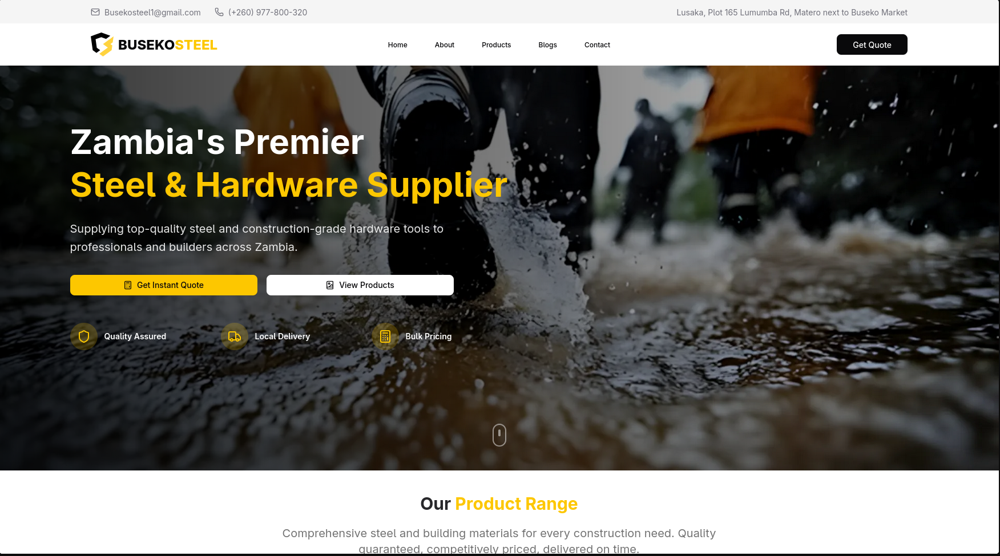
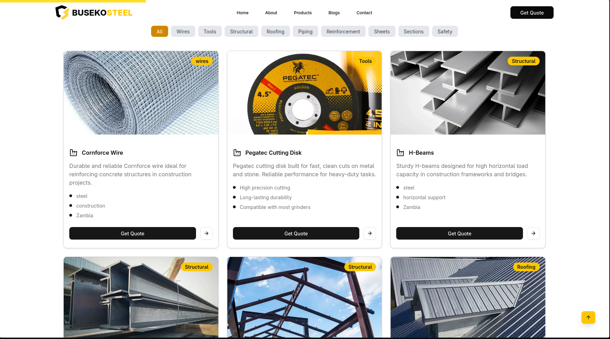
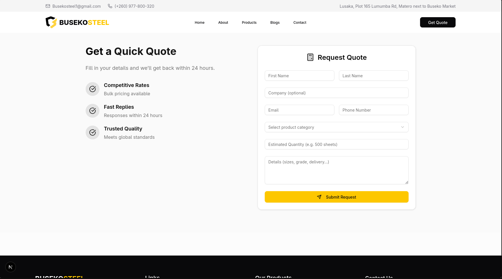
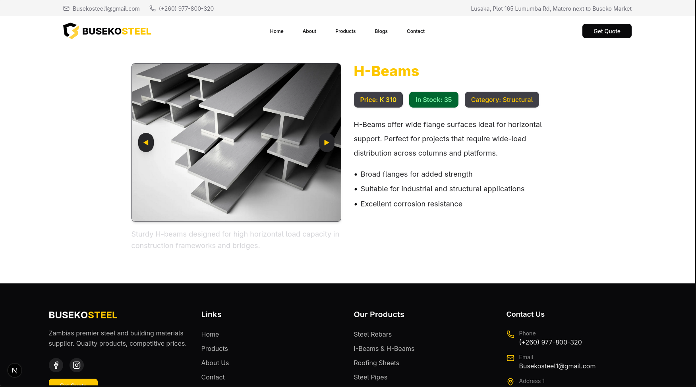
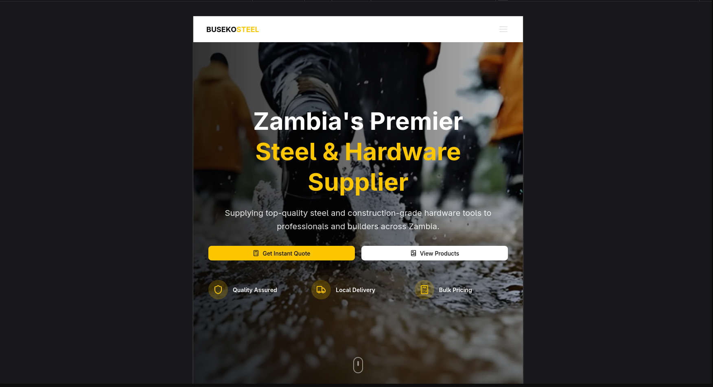

# 🏗️ Buseko Steel Website

This website was designed and developed for **Buseko**, a supplier of steel products and construction tools based in Zambia. The goal was to create a fast, modern, mobile-friendly website that clearly showcases products, builds trust, and allows potential customers to request quotations.

---

## 🔍 Project Overview

**Client:** Buseko Steel
**Location:** Lusaka, Zambia
**Objective:** Present steel products professionally online, support quote requests, and create a trusted local presence.

---

## 🖼️ 1. Landing Page

**Goal:**
Make a strong first impression using bold imagery, brand colors (yellow and black), and highlight Buseko’s offerings quickly.

**Features:**
- Large background image
- Headline and subtext
- Primary Call-to-Action
- Key trust indicators like "Quality Assured" and "Local Delivery"

**📸 Preview:**


---

## 🧰 2. Product Grid

**Goal:**
Showcase different steel and hardware products in a clean, organized, responsive layout.

**Features:**
- Dynamic product listing with categories
- Hover effects
- Description, features, and images per product
- Filtering by type (e.g., Structural, Roofing, Safety)

**📸 Preview:**


---

## 📝 3. Quotation Section

**Goal:**
Allow customers to easily send quote requests based on selected products or general needs.

**Features:**
- Contact form with subject options (e.g., Place Order, Bulk Inquiry)
- Clean, minimal design
- Pre-defined topics for structured communication

**📸 Preview:**


---

## 📦 4. Product Detail (Markdown Structure)

**Goal:**
Create structured, readable product descriptions using markdown for easy updates and scalability.

**Features:**
- Product title, description, and features
- Consistent formatting
- Example: H-Beams, Work Suits, Oegtec Cutting Disk

**📸 Preview:**


---

**💻 Markdown Snippet:**

```markdown
---
title: "Cornforce Wire"
price: 120
category: "wires"
stock: 50
date: "2025-07-01"
features:
  - steel
  - construction
  - Zambia
images:
  - "/images/products/Wires/corn03force.webp"
  - "/images/products/Wires/corn01force.jpg"
  - "/images/products/Wires/corn02force.webp"
description: "Durable and reliable Cornforce wire ideal for reinforcing concrete structures in construction projects."
---

Cornforce wire offers excellent tensile strength and corrosion resistance, making it ideal for use in Zambia’s demanding construction environments.

- Made from high-quality steel
- Suitable for slabs, columns, and beams
- Resists rust and maintains structure over time
```
## 📲 5. Responsive Design

**Goal:**
Ensure the website looks good on mobile, tablet, and desktop.

**Features:**
- Tailwind CSS-based grid system
- Fluid layouts
- Optimized image loading

**📸 Preview:**


---


## ⚙️ Technologies Used

### 🛠 Tech Stack Used

- **Next.js** – React framework for fast page loading and routing
- **Tailwind CSS** – Utility-first CSS framework for design speed
- **ShadCN/UI** – Pre-built, beautiful UI components powered by Tailwind
- **Framer Motion** – For subtle page and component animations
- **Lucide Icons** – For clean, consistent icons
- **Markdown** – To describe and manage product details dynamically
- **MD Formatter** – For formatting and rendering Markdown content
- **Nodemailer** – For handling form submissions and sending emails


---

## 🚀 Summary

This project reflects a practical solution for a Zambian construction supplier to go digital. Every section is built with speed, clarity, and usability in mind — making it easier for customers to explore, inquire, and build trust with Buseko.

---

## 📞 Contact

**David Chilanzi Sensenta**
Software Developer | UX Designer | Frontend Developer
📧 chilanzi11037@gmail.com
📱 +260 771 923 958
🌍 Zambia

---

> You’re free to view this project and its source code, but reuse is restricted unless granted permission by the developer.
